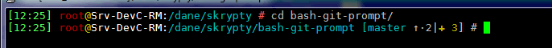

# Kolorowanie w bashu + pełne wsparcie dla gita z autouzupełnianiem :)

Jest to FORK z https://github.com/magicmonty/bash-git-prompt dostosowany do mojego skryptu koloryzującego basha.  
Instalacja:

```sh
sudo install -m 777 -d /dane/skrypty/
cd /dane/skrypty/ 
sudo git clone git@192.168.10.100:m.rygiel/bash-git-prompt.git
sudo cp -f /dane/skrypty/bash-git-prompt/etc/bashrc /etc/bashrc
```

Po czym trzeba się przelogować.

Efekt końcowy:




# Dziwne krzaki w konsoli?
Aby symbole poprawnie Wam się wyświetlały w konsoli - trzeba ustawić sobie czcionkę "DejaVu Sans Mono" (środkowo-europejski).

Można to zrobić w Putty:   
1) klikając na tytule okna prawym przyciskiem myszki   
2) z menu wybrać "Change Settings..."  
3) w oknie ustawień - z menu po lewej stronie wybrać "Window" / "Apperance"   
4) po prawiej stronie w sekcji "Font settings" kliknąć w "Change..." i wybrać odpowiednią czcionkę.  
5) teraz warto jeszcze przejść do sekcji po lewej stronie "Session"  
6) po prawej stronie wybrać "Default Settings" i kliknąć "Save" (to zapiszę wybraną czcionkę jako ustawienie domyślne)

Pewnie jakieś inne czcionki też dobrze działają, pamiętajcie tylko aby to była czcionka o stałej szerokości znaków.  
Jak zamiast symboli macie jakieś krzaczki/kwadraciki to znaczy, że macie ustawioną złą czcionkę.


# Known Bugs
* Wsparcie dla GIT-a (dodatkowy panel) nie wyświetla się w subshell-u MC (midnight commander-a), czyli konsola w trybie CTRL+O nie działa jak trzeba. Tymczasowy walkaround to po prostu wyjście z MC.


